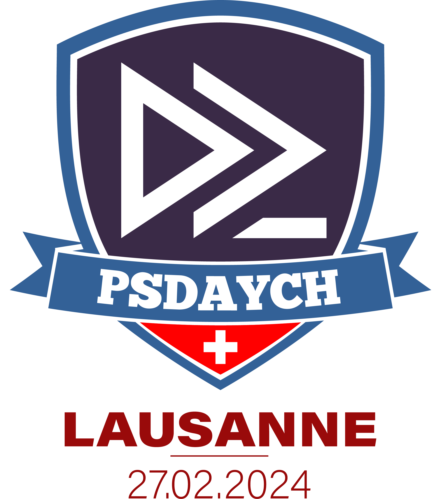

# PowerShell Day Switzerland - 27.2.2024

What a great day we had!

[PSDayCH 2024](https://synedgy.com/psdaych) in Lausanne was awesome, we had a blast
thanks to the speakers coming from across the world to share their knowledge, and to all the attendees who made this event
such a fun and friendly community gathering.

We hope you've enjoyed the event and you've learnt something!  
Please find below the links to the session materials.

Feel free to follow our  [SynEdgy LinkedIn](https://www.linkedin.com/company/synedgy/) page to keep in touch and be notified of new content and events!

Kind Regards,  
Gael Colas, Director  
 [SynEdgy](https://synedgy.com/)
 
 

---

## Sessions

|Session Title        | Speaker                |   Time   | language |
|---------------------| -----------------------|----------|----------|
| [`From PowerShell one-liners to functions to Modules`](README.md)| Raimund Andrée | 9:00 - 09:45 | EN |
| [`Principes fondamentaux de PowerShell en accéléré`](fr/gaelcolas/fundamentals)| Gael Colas | 9:00 - 10:45 | FR |
| [`RegEx: Zero to Hero in 45min`](README.md)| Mathias R. Jessen | 10:00 - 10:45 | EN |
| [`Introduction aux classes PowerShell`](README.md)| Stephane van Gulick | 10:00 - 10:45 | FR |
| [`[Follow-Along] Build a Service Catalog with PowerShell Universal`](README.md)| Adam Driscoll | 11:00 - 12:45 | EN |
| [`[Follow-Along] PowerShell Universal: Codez votre portail Web en PowerShell`](README.md)| Arnaud Petitjean | 11:00 - 12:45 | FR |
| [`PSBlazor - A new PowerShell web technology`](README.md)| Adam Driscoll | 14:00 - 14:45 | EN |
| [`Exchange server : migration hybride à l'aide de PowerShell`](README.md)| Rodrigue Yengo | 14:00 - 14:45 | FR |
| [`PSPlaceholders a.k.a the jinja tool for PowerShell`](README.md)| Georgi Ivanov | 15:00 - 15:45 | EN |
| [`Générer des rapports design avec PSHTML`](README.md)| Stephane van Gulick | 15:00 - 15:45 | FR |
| [`Empowering M365 Environments with DSC: Control & Documentation via PowerShell`](README.md)| Ryan Bartram | 16:00 - 16:45 | EN |
| [`IaC: Configuration YAML et manipulation en PowerShell`](fr/gaelcolas/yaml)| Gael Colas | 16:00 - 16:45 | FR |
